

  

## ECCV 2020 论文大盘点-目标检测篇

本文盘点ECCV 2020 与目标检测相关的研究，包含目标检测新范式、密集目标检测、点云目标检测、少样本目标检测、水下目标检测、域适应目标检测、弱监督目标检测、训练策略等，总计 41 篇，其中 2 篇 Oral，6 篇 Spotlight，开源或者将开源的有26篇。

其中有众多非常值得参考的工作，比如Facebook的DETR，还有两篇基于训练策略无痛涨点的方法。

下载包含这些论文的 ECCV 2020 所有论文：
[ECCV 2020 论文合集下载，分类盘点进行中](http://mp.weixin.qq.com/s?__biz=MzUzODkxNzQzMw==&mid=2247485298&idx=1&sn=b63aab38c48baf6491996e286987d5d8&chksm=fad12824cda6a13203b393c15e96e1ad6ec0241a820c7ea537ed5cf52a74531b17df634f3dc8&scene=21#wechat_redirect)

## 目标检测新范式
### 1.[End-to-End Object Detection with Transformers](https://arxiv.org/abs/2005.12872)

作者 | Nicolas Carion, Francisco Massa, Gabriel Synnaeve, Nicolas Usunier, Alexander Kirillov, Sergey Zagoruyko

单位 | Facebook AI

代码 | https://github.com/facebookresearch/detr (目前已有4.8K星)

解读 | 模型的跨界：我拿Transformer去做目标检测，结果发现效果不错

备注 | ECCV 2020 Oral

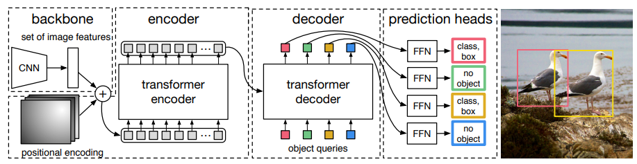

### 2.[GeoGraph: Graph-based multi-view object detection with geometric cues end-to-end](https://arxiv.org/abs/2003.10151)

作者 | Ahmed Samy Nassar, Stefano D'Aronco, Sébastien Lefèvre, Jan D. Wegner

单位 | IRISA, Universite Bretagne Sud；苏黎世联邦理工学院

基于图的检测方法在城市多视角目标检测中的应用，在精度和效率方面都好于之前的方法。

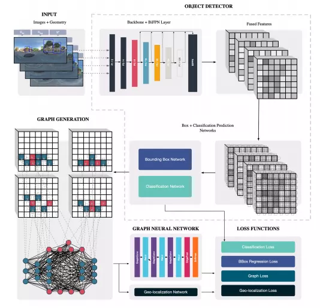

### 3.[UFO²: A Unified Framework towards Omni-supervised Object Detection9](https://www.ecva.net/papers/eccv_2020/papers_ECCV/papers/123640290.pdf)

作者 | Zhongzheng Ren , Zhiding Yu, Xiaodong Yang , Ming-Yu Liu,Alexander G. Schwing,  Jan Kautz

单位 | 伊利诺伊大学厄巴纳-香槟分校；英伟达

这篇论文从最大限度利用数据集的标注出发，提出一种既能利用目标检测包围框标注，又能利用弱监督标注的目标检测训练统一框架，在实际应用中能最大限度利用训练样本，感觉这是个很好的想法。

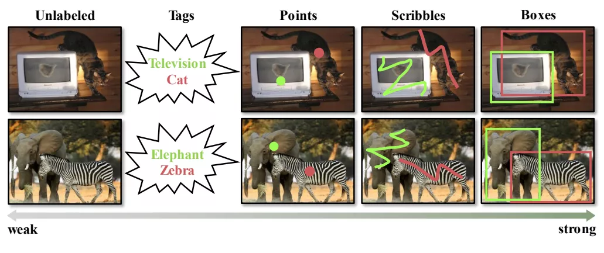

## 密集目标检测

### 4.[BorderDet: Border Feature for Dense Object Detection](https://arxiv.org/abs/2007.11056)

作者 | Han Qiu, Yuchen Ma, Zeming Li, Songtao Liu, Jian Sun

单位 | 旷视科技；西安交通大学

论文 | https://arxiv.org/abs/2007.11056

代码 | https://github.com/Megvii-BaseDetection/BorderDet

备注 | ECCV 2020 Oral

该文提出了一种非常简单、高效的操作来提取物体边界极限点的特征，叫做“BorderAlign”。模型只增加很少的时间开销，可以在经典模型上实现FCOS(38.6 v.s. 41.4). FPN(37.1 v.s. 40.7)。

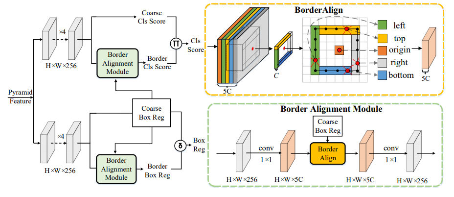

## Anchor-free 目标检测
### 5.[Corner Proposal Network for Anchor-free, Two-stage Object Detection](https://arxiv.org/abs/2007.13816)

作者 | Kaiwen Duan, Lingxi Xie, Honggang Qi, Song Bai, Qingming Huang, Qi Tian

单位 | 国科大；华为；华中科技大学；鹏城实验室

论文 | https://arxiv.org/abs/2007.13816

代码 | https://github.com/Duankaiwen/CPNDet（即将）

备注 | ECCV 2020 Spotlight

[video](链接)

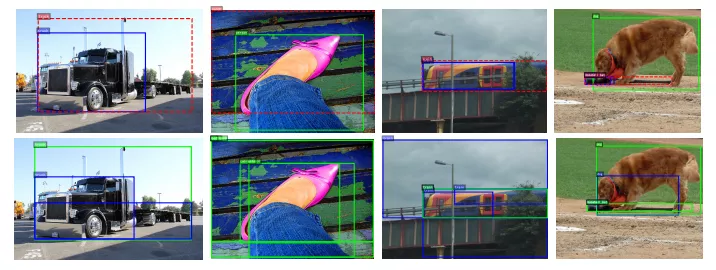

## 目标检测错误分析工具
### 6.[TIDE: A General Toolbox for Identifying Object Detection Errors](https://arxiv.org/abs/2008.08115)

作者 | Daniel Bolya, Sean Foley, James Hays, Judy Hoffman

单位 | 佐治亚理工学院

论文 | https://arxiv.org/abs/2008.08115

代码 | https://github.com/dbolya/tide

主页 | https://dbolya.github.io/tide/

备注 | ECCV 2020 Spotlight

[video](https://v.qq.com/x/page/g3145s8j2tw.html)

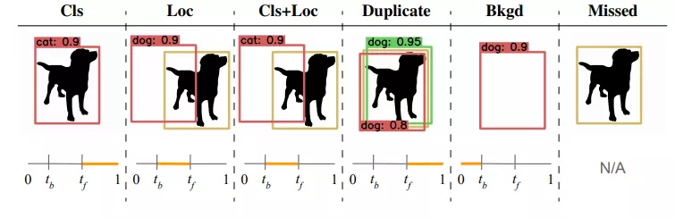

## 多目标检测和跟踪
### 7.[Chained-Tracker: Chaining Paired Attentive Regression Results for End-to-End Joint Multiple-Object Detection and Tracking](https://arxiv.org/abs/2007.14557)

作者 | Jinlong Peng, Changan Wang, Fangbin Wan, Yang Wu, Yabiao Wang, Ying Tai, Chengjie Wang, Jilin Li, Feiyue Huang, Yanwei Fu

单位 | 腾讯优图实验室；复旦大学；NAIST

论文 | https://arxiv.org/abs/2007.14557

代码 | https://github.com/pjl1995/CTracker

备注 | ECCV 2020 Spotlight

[video](链接)

## 带方向目标的检测
### 8.[PIoU Loss: Towards Accurate Oriented Object Detection in Complex Environments

作者 | Zhiming Chen, Kean Chen, Weiyao Lin, John See, Hui Yu, Yan Ke, Cong Yang

单位 | 扩博智能Clobotics；上海交通大学；多媒体大学

论文 | https://arxiv.org/abs/2007.09584

代码 | https://github.com/clobotics/piou

备注 | ECCV 2020 Spotlight

[video](链接)

### 9.[Arbitrary-Oriented Object Detection with Circular Smooth Label](https://arxiv.org/abs/2003.05597)

作者 | Xue Yang, Junchi Yan

单位 | 上海交通大学

论文 | https://arxiv.org/abs/2003.05597

代码 | https://github.com/Thinklab-SJTU/CSL_RetinaNet_Tensorflow

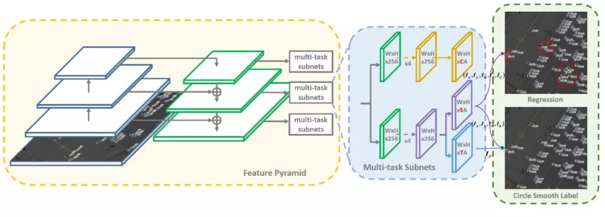

## 目标检测定位提精
### 10.[Side-Aware Boundary Localization for More Precise Object Detection](https://arxiv.org/abs/1912.04260)

作者 | Jiaqi Wang, Wenwei Zhang, Yuhang Cao, Kai Chen, Jiangmiao Pang, Tao Gong, Jianping Shi, Chen Change Loy, Dahua Lin

单位 | 香港中文大学；南洋理工大学；商汤；浙大；国科大

论文 | https://arxiv.org/abs/1912.04260

代码 | https://github.com/open-mmlab/mmdetection

备注 | ECCV 2020 Spotlight

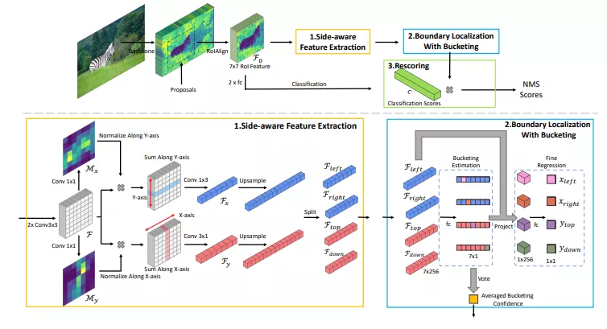

## 弱监督目标检测
### 11.[Many-shot from Low-shot: Learning to Annotate using Mixed Supervision for Object Detection](https://arxiv.org/abs/2008.09694)

作者 | Carlo Biffi, Steven McDonagh, Philip Torr, Ales Leonardis, Sarah Parisot

单位 | 华为；Mila Montr´eal；牛津大学

论文 | https://arxiv.org/abs/2008.09694

该文提出一种在线样本标注方法，可在任意目标检测算法训练中利用数据弱监督信息扩充训练样本，在Faster RCNN的实验中，分别取得了17%  mAP, 9%  AP50 提升在PASCAL VOC 2007 、 MS-COCO数据集上。

[video](https://v.qq.com/x/page/h3146mz50t1.html)

##
### 12.[Enabling Deep Residual Networks for Weakly Supervised Object Detection](https://www.ecva.net/papers/eccv_2020/papers_ECCV/papers/123530120.pdf)

作者 | Yunhang Shen, Rongrong Ji , Yan Wang, Zhiwei Chen, Feng Zheng ,Feiyue Huang , Yunsheng Wu

单位 | 厦门大学；Pinterest；南科大；腾讯优图（上海）

论文 | https://www.ecva.net/papers/eccv_2020/papers_ECCV/papers/123530120.pdf

代码 | https://github.com/shenyunhang/DRN-WSOD

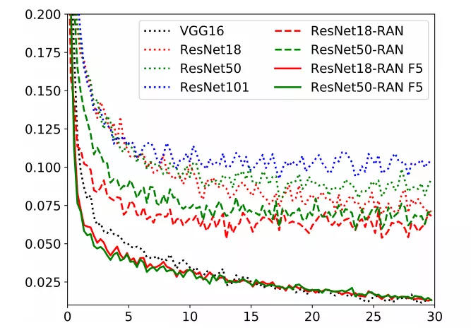

##
### 13.[Boosting Weakly Supervised Object Detection with Progressive Knowledge Transfer](https://arxiv.org/abs/2007.07986)

单位 | 伊利诺伊大学厄巴纳-香槟分校；微软

论文 | https://arxiv.org/abs/2007.07986

代码 | https://github.com/mikuhatsune/wsod_transfer

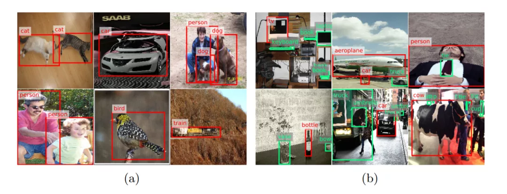

##
### 14.[Cheaper Pre-training Lunch: An Efficient Paradigm for Object Detection](https://arxiv.org/abs/2004.12178)

作者 | Dongzhan Zhou, Xinchi Zhou, Hongwen Zhang, Shuai Yi, Wanli Ouyang

单位 | 悉尼大学，商汤CV研究小组；中科院&国科大；商汤

论文 | https://arxiv.org/abs/2004.12178

该文发明了一种计算代价小却能改进目标检测精度的预训练方法Montage pre-training。

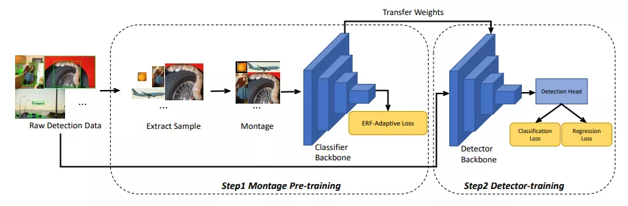

## 目标检测、实例分割、姿态估计全家桶
### 15.[Point-Set Anchors for Object Detection, Instance Segmentation and Pose Estimation](https://arxiv.org/abs/2007.02846)

作者 | Fangyun Wei, Xiao Sun, Hongyang Li, Jingdong Wang, Stephen Lin

单位 | 微软亚洲研究院；北大

论文 | https://arxiv.org/abs/2007.02846

代码 | https://github.com/FangyunWei/PointSetAnchor

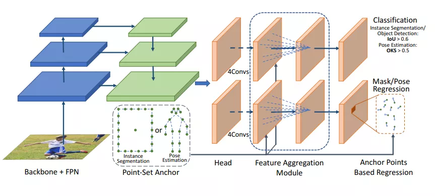

## 点云目标检测
### 16.[ SPOT: Selective Point Cloud Voting for Better Proposal in Point Cloud Object Detection](https://www.ecva.net/papers/eccv_2020/papers_ECCV/papers/123560222.pdf)

作者 | Hongyuan Du, Linjun Li, Bo Liu, and Nuno Vasconcelos

单位 | 加利福尼亚大学圣迭戈分校

论文 | https://www.ecva.net/papers/eccv_2020/papers_ECCV/papers/123560222.pdf

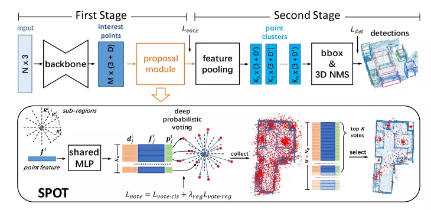

### 17.[ Streaming Object Detection for 3-D Point Clouds](https://arxiv.org/abs/2005.01864)

作者 | Wei Han, Zhengdong Zhang, Benjamin Caine, Brandon Yang, Christoph Sprunk, Ouais Alsharif, Jiquan Ngiam, Vijay Vasudevan, Jonathon Shlens, Zhifeng Chen

单位 | 谷歌等

论文 | https://arxiv.org/abs/2005.01864

##
### 18.[ Pillar-based Object Detection for Autonomous Driving](https://arxiv.org/abs/2007.10323)

作者 | Yue Wang, Alireza Fathi, Abhijit Kundu, David Ross, Caroline Pantofaru, Thomas Funkhouser, Justin Solomon

单位 | 麻省理工学院；谷歌

论文 | https://arxiv.org/abs/2007.10323

代码 | https://github.com/WangYueFt/pillar-od

备注 | ECCV 2020

##
### 19.[SSN: Shape Signature Networks for Multi-class Object Detection from Point Clouds](https://arxiv.org/abs/2004.02774)

作者 | Xinge Zhu      Yuexin Ma      Tai Wang      Yan Xu Jianping Shi      Dahua Lin

单位 | 香港中文大学；商汤科技；香港浸会大学

论文 | https://arxiv.org/abs/2004.02774

代码 | https://github.com/xinge008/SSN（尚未开源）

[video](链接)

##
### 20.[

[video](链接)

##
### 21.[

[video](链接)

