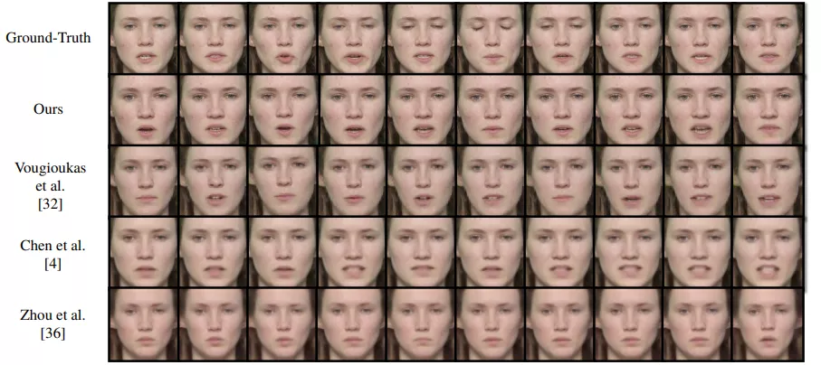

  

本文盘点ECCV 2020 所有与人脸相关的研究，涵盖人脸各子领域，总计46篇文章，涉及21个方向。

除了常见的人脸检测、对齐、识别、活体检测，人脸合成、编辑、重建、动画等技术都非常吸引人。

下载包含这些论文的 ECCV 2020 所有论文：

[ECCV 2020 论文合集下载，分类盘点进行中](http://mp.weixin.qq.com/s?__biz=MzUzODkxNzQzMw==&mid=2247485298&idx=1&sn=b63aab38c48baf6491996e286987d5d8&chksm=fad12824cda6a13203b393c15e96e1ad6ec0241a820c7ea537ed5cf52a74531b17df634f3dc8&scene=21#wechat_redirect)

## 密集人脸对齐
### 1、[“Look Ma, no landmarks!” – Unsupervised, Model-based Dense Face Alignment](https://www.ecva.net/papers/eccv_2020/papers_ECCV/papers/123470681.pdf)

作者 | Tatsuro Koizumi， William A. P. Smith

单位 | 佳能公司；约克大学

备注 | ECCV 2020 Oral

## [video](https://v.qq.com/x/page/b31496l64v5.html)

## 三维密集型人脸对齐
### 2、[Towards Fast, Accurate and Stable 3D Dense Face Alignment](https://www.ecva.net/papers/eccv_2020/papers_ECCV/papers/123640154.pdf)

作者 | Jianzhu Guo, Xiangyu Zhu, Yang Yang, Fan Yang, Zhen Lei, Stan Z. Li

单位 | 中科院；国科大；北航；西湖大学

代码 | https://github.com/cleardusk/3DDFA_V2

备注 | ECCV 2020

[video](链接)

## 人脸年龄分析
### 3、[Hierarchical Face Aging through Disentangled Latent Characteristics](https://www.ecva.net/papers/eccv_2020/papers_ECCV/papers/123480086.pdf)

作者 | Peipei Li, Huaibo Huang, Yibo Hu, Xiang Wu, Ran He, Zhenan Sun

单位 | 中科院自动化研究所；中科院；国科大

备注 | ECCV 2020 Oral

## 人脸年龄估计
### 4、[Adaptive Variance Based Label Distribution Learning For Facial Age Estimation](https://www.ecva.net/papers/eccv_2020/papers_ECCV/papers/123680375.pdf)

作者 | Xin Wen, Biying Li, Haiyun Guo, Zhiwei Liu, Guosheng Hu, Ming Tang, Jinqiao Wang

单位 | 中科院；国科大等

备注 | ECCV 2020

## 人脸识别

### 5、[Semi-Siamese Training for Shallow Face Learning](https://arxiv.org/abs/2007.08398)

浅层人脸学习

作者 | Hang Du, Hailin Shi, Yuchi Liu, Jun Wang, Zhen Lei, Dan Zeng, Tao Mei

单位 | 上海大学;京东AI；中科院自动化研究所 

代码 | https://github.com/dituu/Semi-Siamese-Training

备注 | ECCV 2020 Spotlight

### 6、[BroadFace: Looking at Tens of Thousands of People at Once for Face Recognition](https://arxiv.org/abs/2008.06674
)

作者 | Yonghyun Kim, Wonpyo Park, Jongju Shin

单位 | kakaoenterprise；Kakao Corp

备注 | ECCV 2020

## [video](https://v.qq.com/x/page/k3149pd9bkb.html)

### 7、[Sub-center ArcFace: Boosting Face Recognition by Large-scale Noisy Web Faces](https://www.ecva.net/papers/eccv_2020/papers_ECCV/papers/123560715.pdf)

作者 | Jiankang Deng, Jia Guo, Tongliang Liu, Mingming Gong, Stefanos Zafeiriou

单位 | 帝国理工学院；InsightFace；悉尼大学；墨尔本大学

备注 | ECCV 2020

### 8、[BioMetricNet: deep unconstrained face verification through learning of metrics regularized onto Gaussian distributions](https://www.ecva.net/papers/eccv_2020/papers_ECCV/papers/123700137.pdf)

人脸验证 生物识别认证

作者 | Arslan Ali, Matteo Testa, Tiziano Bianchi, Enrico Magli

单位 | 都灵理工大学

备注 | ECCV 2020

### 9、[Generate to Adapt: Resolution Adaption Network for Surveillance Face Recognition](https://www.ecva.net/papers/eccv_2020/papers_ECCV/papers/123600732.pdf)

用于监控人脸识别的分辨率自适应网络

作者 | Han Fang, Weihong Deng∗ , Yaoyao Zhong,  Jiani Hu

单位 | 北京邮电大学

备注 | ECCV 2020

### 10、[Caption-Supervised Face Recognition: Training a State-of-the-Art Face Model without Manual Annotation](https://www.ecva.net/papers/eccv_2020/papers_ECCV/papers/123620137.pdf)

作者 | Qingqiu Huang, Lei Yang, Huaiyi Huang, Tong Wu, Dahua Lin

单位 | 港中文；清华

备注 | ECCV 2020

实验表明，使用所提出的方法，可以在没有人工标注的情况下训练出一个SOTA人脸识别模型（在LFW中达到99.65%）。显示了字幕监督下的人脸识别的巨大潜力。

### 11、[Improving Face Recognition by Clustering Unlabeled Faces in the Wild](https://www.ecva.net/papers/eccv_2020/papers_ECCV/papers/123690120.pdf)

作者 | Aruni RoyChowdhury, Xiang Yu, Kihyuk Sohn, Erik Learned-Miller, Manmohan Chandraker

单位 | 马萨诸塞大学；NEC Labs America；UC San Diego

备注 | ECCV 2020

### 12、[Exclusivity-Consistency Regularized Knowledge Distillation for Face Recognition](https://www.ecva.net/papers/eccv_2020/papers_ECCV/papers/123690324.pdf)

作者 | Xiaobo Wang, Tianyu Fu, Shengcai Liao, Shuo Wang, Zhen Lei, Tao Mei

单位 | 京东AI；IIAI；中科院；国科大

代码 | http://www.cbsr.ia.ac.cn/users/xiaobowang/（未发布）

备注 | ECCV 2020

### 13、[Explainable Face Recognition](https://arxiv.org/abs/2008.00916)

作者 | Jonathan R. Williford, Brandon B. May, Jeffrey Byrne

单位 | Systems & Technology Research；Visym Labs, Cambridge

代码 | https://github.com/stresearch/xfr

主页 | https://stresearch.github.io/xfr/

备注 | ECCV 2020

### 14、[Manifold Projection for Adversarial Defense on Face Recognition](https://www.ecva.net/papers/eccv_2020/papers_ECCV/papers/123750290.pdf)

作者 | Jianli Zhou, Chao Liang, Jun Chen

单位 | 武汉大学等

备注 | ECCV 2020

### 15、[Jointly De-biasing Face Recognition and Demographic Attribute Estimation](https://arxiv.org/abs/1911.08080)

作者 | Sixue Gong, Xiaoming Liu, Anil K. Jain

单位 | 密歇根州立大学

备注 | ECCV 2020

### 16、[Improving Face Recognition from Hard Samples via Distribution Distillation Loss](https://arxiv.org/abs/2002.03662)

作者 | Yuge Huang, Pengcheng Shen, Ying Tai, Shaoxin Li, Xiaoming Liu, Jilin Li, Feiyue Huang, Rongrong Ji

单位 | 腾讯优图；密歇根州立大学；厦门大学

代码 | https://github.com/HuangYG123/DDL（即将）

备注 | ECCV 2020

## 三维人脸重建
### 17、[Beyond 3DMM Space: Towards Fine-grained 3D Face Reconstruction](https://www.ecva.net/papers/eccv_2020/papers_ECCV/papers/123530341.pdf)

作者 | Xiangyu Zhu, Fan Yang, Di Huang, Chang Yu, Hao Wang, Jianzhu Guo, Zhen Lei, Stan Z. Li

单位 | 中科院自动化所；国科大；北航；西湖大学

代码 | https://github.com/XiangyuZhu-open/Beyond3DMM（未开源）

备注 | ECCV 2020

### 18、[Inequality-Constrained and Robust 3D Face Model Fitting](https://www.ecva.net/papers/eccv_2020/papers_ECCV/papers/123540409.pdf)

作者 | Evangelos Sariyanidi, Casey J. Zampella, Robert T. Schultz, Birkan Tunc

单位 | 费城儿童医院；宾夕法尼亚大学

代码 | https://github.com/sariyanidi/3DI

备注 | ECCV 2020

### 19、[JNR: Joint-based Neural Rig Representation for Compact 3D Face Modeling](https://arxiv.org/abs/2007.06755)

作者 | Noranart Vesdapunt, Mitch Rundle, HsiangTao Wu, Baoyuan Wang

单位 | Microsoft Cloud and AI 

备注 | ECCV 2020

### 20、[Personalized Face Modeling for Improved Face Reconstruction and Motion Retargeting](https://arxiv.org/abs/2007.06759)

人脸建模以改善人脸重建和运动重定位

作者 | Bindita Chaudhuri, Noranart Vesdapunt, Linda Shapiro, Baoyuan Wang

单位 | 华盛顿大学；Microsoft Cloud and AI

主页 | https://homes.cs.washington.edu/~bindita/personalizedfacemodeling.html

备注 | ECCV 2020 Spotlight

来自华盛顿大学和微软的研究人员在ECCV 2020 论文中，提出一种个性化的人脸建模方法，可以更加精细捕获人脸动态，有效分离人脸模型与运动模型，显著提高人脸三维重建和运动重定向的效果。

## [video](https://v.qq.com/x/page/d314931zmkv.html)

### 21、[Self-Supervised Monocular 3D Face Reconstruction by Occlusion-Aware Multi-view Geometry Consistency](https://arxiv.org/abs/2007.12494)

## 单目3D人脸重建

作者 | Jiaxiang Shang, Tianwei Shen, Shiwei Li, Lei Zhou, Mingmin Zhen, Tian Fang, Long Quan

单位 | 香港科技大学；Everest Innovation Technology

代码 | https://github.com/jiaxiangshang/MGCNet

备注 | ECCV 2020

## [video](https://v.qq.com/x/page/h3149uesoz9.html)

### 22、[Eyeglasses 3D shape reconstruction from a single face image](https://www.ecva.net/papers/eccv_2020/papers_ECCV/papers/123700375.pdf)

作者 | Yating Wang, Quan Wang, Feng Xu

单位 | 清华；商汤

备注 | ECCV 2020

### 23、[Synthesizing Coupled 3D Face Modalities by Trunk-Branch Generative Adversarial Networks](https://arxiv.org/abs/1909.02215)

作者 | Baris Gecer, Alexander Lattas, Stylianos Ploumpis, Jiankang Deng, Athanasios Papaioannou, Stylianos Moschoglou, Stefanos Zafeiriou

单位 | 帝国理工学院；FaceSoft.io

代码 | https://github.com/barisgecer/TBGAN（即将）

备注 | ECCV 2020

该文提出Trunk-Branch GAN,可利用不同模态数据之间的相关性进行高质量、高逼真度3D人脸生成，并能使用条件对人脸表情进行调整。

## [video](https://v.qq.com/x/page/u31501vg3pb.html)

## 人脸检测
### 24、[ProgressFace: Scale-Aware Progressive Learning for Face Detection](https://www.ecva.net/papers/eccv_2020/papers_ECCV/papers/123510341.pdf)

作者 | Jiashu Zhu, Dong Li, Tiantian Han, Lu Tian,  Yi Shan

单位 | Xilinx Inc
 
代码 | https://github.com/jiashu-zhu/ProgressFace（尚未开源）

备注 | ECCV 2020 Spotlight

### 25、[Design and Interpretation of Universal Adversarial Patches in Face Detection](https://arxiv.org/abs/1912.05021)

作者 | Xiao Yang, Fangyun Wei, Hongyang Zhang, Jun Zhu

单位 | 清华；微软亚洲研究院；TTIC

备注 | ECCV 2020

## 人脸幻构（face hallucination）

### 26、[Blind Face Restoration via Deep Multi-scale Component Dictionaries](https://arxiv.org/abs/2008.00418)

作者 | Xiaoming Li, Chaofeng Chen, Shangchen Zhou, Xianhui Lin, Wangmeng Zuo, Lei Zhang

单位 | 哈尔滨工业大学；香港大学；南洋理工大学；阿里达摩院；鹏城实验室；香港理工大学

代码 | https://github.com/csxmli2016/DFDNet

备注 | ECCV 2020

## 人脸反欺诈、活体检测（Face Anti-Spoofing）

### 27、[CelebA-Spoof: Large-Scale Face Anti-Spoofing Dataset with Rich Annotations](https://arxiv.org/abs/2007.12342)

活脸检测（Face Anti-Spoofing）大规模数据集

作者 | Yuanhan Zhang, Zhenfei Yin, Yidong Li, Guojun Yin, Junjie Yan, Jing Shao, Ziwei Liu

单位 | 北京交通大学；商汤；港中文

数据集 | https://github.com/Davidzhangyuanhan/CelebA-Spoof

备注 | ECCV 2020

## [video](https://v.qq.com/x/page/s3149pudg74.html)

### 28、[On Disentangling Spoof Trace for Generic Face Anti-Spoofing](https://arxiv.org/abs/2007.09273)

作者 | Yaojie Liu, Joel Stehouwer, Xiaoming Liu

单位 | 密歇根州立大学

代码 | https://github.com/yaojieliu/ECCV20-STDN

主页 | http://cvlab.cse.msu.edu/project-face-anti.html

备注 | ECCV 2020

[PC端演示 demo](https://v.qq.com/x/page/r3149jdhucd.html)

[手机端演示demo](https://v.qq.com/x/page/g3149rexkqv.html)

## 人脸图像生成
### 29、[CONFIG: Controllable Neural Face Image Generation](https://arxiv.org/abs/2005.02671)

作者 | Marek Kowalski, Stephan J. Garbin, Virginia Estellers, Tadas Baltrušaitis, Matthew Johnson, Jamie Shotton

单位 | 微软

代码 | https://github.com/microsoft/ConfigNet

备注 | ECCV 2020

[video](链接)

### 30、[High Resolution Zero-Shot Domain Adaptation of Synthetically Rendered Face Images](https://arxiv.org/abs/2006.15031)

高分辨率人脸合成

作者 | Stephan J. Garbin, Marek Kowalski, Matthew Johnson, Jamie Shotton

单位 | 微软 

备注 | ECCV 2020

[video](链接)

## 人脸伪造检测
### 31、[Thinking in Frequency: Face Forgery Detection by Mining Frequency-aware Clues]( https://arxiv.org/abs/2007.09355)

作者 | Yuyang Qian, Guojun Yin, Lu Sheng, Zixuan Chen, Jing Shao

单位 | 商汤；电子科技大学；北航；西北工业大学

备注 | ECCV 2020

[video](链接)

## 人脸解析
### 32、[Edge-aware Graph Representation Learning and Reasoning for Face Parsing](https://arxiv.org/abs/2007.11240)

作者 | Gusi Te, Yinglu Liu, Wei Hu, Hailin Shi, Tao Mei

单位 | 北大；京东AI

代码 | https://github.com/tegusi/EAGRNet

备注 | ECCV 2020

[video](链接)

## 人脸正面化
### 33、[Learning Flow-based Feature Warping for Face Frontalization with Illumination Inconsistent Supervision](https://arxiv.org/abs/2008.06843)

作者 | Yuxiang Wei, Ming Liu, Haolin Wang, Ruifeng Zhu, Guosheng Hu, Wangmeng Zuo

单位 | 哈工大等

代码 | https://github.com/csyxwei/FFWM

备注 | ECCV 2020

## 人脸属性编辑
### 34、[CAFE-GAN: Arbitrary Face Attribute Editing with Complementary Attention Feature](https://www.ecva.net/papers/eccv_2020/papers_ECCV/papers/123590511.pdf)

作者 | Jeong gi Kwak, David K. Han, Hanseok Ko

单位 | 高丽大学；ARL

备注 | ECCV 2020

### 35、[CooGAN: A Memory-Efficient Framework for High-Resolution Facial Attribute Editing](https://www.ecva.net/papers/eccv_2020/papers_ECCV/papers/123560647.pdf)
人脸属性编辑 GAN

作者 | Xuanhong Chen, Bingbing Ni, Naiyuan Liu, Ziang Liu, Yiliu Jiang, Loc Truong, Qi Tian

单位 | 上海交通大学；Huawei HiSilicon；华为

代码 | https://github.com/XHChen0528/CooGAN

备注 | ECCV 2020

### 36、[SSCGAN: Facial Attribute Editing via Style Skip Connections](https://www.ecva.net/papers/eccv_2020/papers_ECCV/papers/123600409.pdf)

作者 | Wenqing Chu, Ying Tai, Chengjie Wang, Jilin Li, Feiyue Huang, Rongrong Ji

单位 | 腾讯优图；厦门大学

备注 | ECCV 2020

### 37、[ByeGlassesGAN: Identity Preserving Eyeglasses Removal for Face Images](https://arxiv.org/abs/2008.11042)

人脸属性编辑，去眼镜，GAN

作者 | Yu-Hui Lee, Shang-Hong Lai

单位 | 台湾清华大学；微软人工智能研发中心（中国台湾）

备注 | ECCV 2020

## 人脸表情识别
### 38、[Margin-Mix: Semi–Supervised Learning for Face Expression Recognition](https://www.ecva.net/papers/eccv_2020/papers_ECCV/papers/123680001.pdf)

人脸表情识别+半监督

作者 | Corneliu Florea, Mihai Badea, Laura Florea, Andrei Racoviteanu, Constantin Vertan

单位 | 布加勒斯特理工大学
 
代码 | https://github.com/YU1ut/MixMatch-pytorch

备注 | ECCV 2020

## 人脸表情编辑
### 39、[Toward Fine-grained Facial Expression Manipulation](https://arxiv.org/abs/2004.03132)

作者 | Jun Ling, Han Xue, Li Song, Shuhui Yang, Rong Xie, Xiao Gu

单位 | 上海交通大学

代码 | https://github.com/junleen/Expression-manipulator

备注 | ECCV 2020

## 表情生成、面部动画、4D合成
### 40、[Learning to Generate Customized Dynamic 3D Facial Expressions](https://arxiv.org/abs/2007.09805)

作者 | Rolandos Alexandros Potamias, Jiali Zheng, Stylianos Ploumpis, Giorgos Bouritsas, Evangelos Ververas, Stefanos Zafeiriou

单位 | 帝国理工学院

备注 | ECCV 2020

## 人脸算法偏见研究
### 41、[Towards causal benchmarking of bias in face analysis algorithms](https://arxiv.org/abs/2007.06570)

人脸分析算法偏见测评研究

作者 | Guha Balakrishnan, Yuanjun Xiong, Wei Xia, Pietro Perona

单位 | 麻省理工学院；加州理工学院；Amazon Web Services

备注 | ECCV 2020

[video](链接)

## 人脸匿名化
### 42、[Password-conditioned Anonymization and Deanonymization with Face Identity Transformers](https://arxiv.org/abs/1911.11759)

作者 | Xiuye Gu, Weixin Luo, Michael S. Ryoo, Yong Jae Lee

单位 | 斯坦福大学；UC Davis等

备注 | ECCV 2020

## 人脸超分辨率
### 43、[Face Super-Resolution Guided by 3D Facial Priors](https://arxiv.org/abs/2007.09454)

作者 | Xiaobin Hu, Wenqi Ren, John LaMaster, Xiaochun Cao, Xiaoming Li, Zechao Li, Bjoern Menze, Wei Liu

单位 | 慕尼黑工业大学；中科院；哈工大等

备注 | ECCV 2020 Spotlight

[video](链接)

## 语音驱动的人脸动画
### 44、[Speech-driven Facial Animation using Cascaded GANs for Learning of Motion and Texture](https://www.ecva.net/papers/eccv_2020/papers_ECCV/papers/123750409.pdf)

作者 | Dipanjan Das, Sandika Biswas, Sanjana Sinha, Brojeshwar Bhowmick

单位 | TCS Research, India

备注 | ECCV 2020

[video](链接)

## 语音驱动人脸重演
### 45、[Neural Voice Puppetry: Audio-driven Facial Reenactment](https://arxiv.org/abs/1912.05566)

作者 | Justus Thies, Mohamed Elgharib, Ayush Tewari, Christian Theobalt, Matthias Nießner

单位 | 慕尼黑工业大学；萨尔大学

代码 | https://github.com/JustusThies/NeuralVoicePuppetry

备注 | ECCV 2020

## 显著人脸检测
### 46、[Learning to Predict Salient Faces: A Novel Visual-Audio Saliency Model](https://www.ecva.net/papers/eccv_2020/papers_ECCV/papers/123650409.pdf)

基于语音-视觉的方法

作者 | Yufan Liu, Minglang Qiao, Mai Xu, Bing Li, Weiming Hu, Ali Borji

单位 | 中国科学院自动化研究所；国科大

备注 | ECCV 2020

