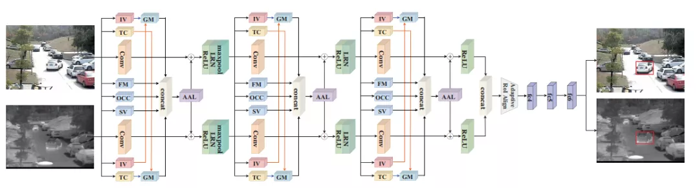
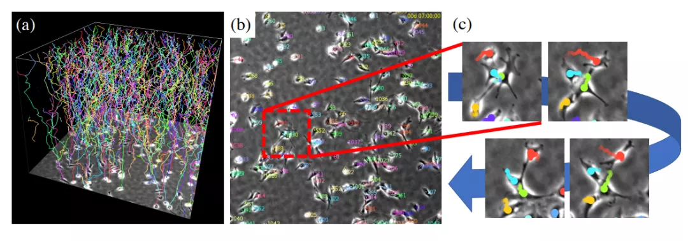

  

本文盘点ECCV 2020 所有与跟踪相关的研究，单指目标的跟踪，不涉及人体姿态等点的跟踪，总计19篇文章，其中12篇开源或者将开源。

其中多目标跟踪、单目标跟踪、对抗学习+目标跟踪研究工作较多。其中有已经特别知名的工作，比如来自CenterNet思想延申的 Tracking Objects as Points ，非常值得关注。

## 多目标跟踪 MOT
### 1.[Chained-Tracker: Chaining Paired Attentive Regression Results for End-to-End Joint Multiple-Object Detection and Tracking](https://arxiv.org/abs/2007.14557)

作者 | Jinlong Peng, Changan Wang, Fangbin Wan, Yang Wu, Yabiao Wang, Ying Tai, Chengjie Wang, Jilin Li, Feiyue Huang, Yanwei Fu

单位 | 腾讯优图；复旦大学；奈良先端科学技术大学院大学

代码 | https://github.com/pjl1995/CTracker

备注 | ECCV 2020 Spotlight

- [video](https://v.qq.com/x/page/k3152fqim69.html)

### 2.[Segment as Points for Efficient Online Multi-Object Tracking and Segmentation](https://arxiv.org/abs/2007.01550)

作者 | Zhenbo Xu, Wei Zhang, Xiao Tan, Wei Yang, Huan Huang, Shilei Wen, Errui Ding, Liusheng Huang

单位 | 中国科学技术大学；百度

代码 | https://github.com/detectRecog/PointTrack

备注 | ECCV2020 Oral

以点分割，实现高效的在线多目标跟踪和分割

### 3.[Tracking Objects as Points](https://arxiv.org/abs/2004.01177)

作者 | Xingyi Zhou, Vladlen Koltun, Philipp Krähenbühl

单位 | 得克萨斯大学奥斯汀分校；英特尔

代码 | https://github.com/xingyizhou/CenterTrack

备注 | ECCV 2020 Spotlight

以22 FPS的速度在MOT17数据集上实现了67.3%的MOTA，以15 FPS的速度在KITTI跟踪基准上实现了89.4%的MOTA。

CenterTrack在最新发布的nuScenes 3D跟踪基准上达到了28.3%AMOTA@0.2，在28 FPS的运行速度下，大幅超越了该基准上的单目基线。

### 4.[Towards Real-Time Multi-Object Tracking](https://arxiv.org/abs/1909.12605)

作者 | Zhongdao Wang, Liang Zheng, Yixuan Liu, Yali Li, Shengjin Wang

单位 | 清华大学；澳大利亚国立大学

代码 | https://github.com/Zhongdao/Towards-Realtime-MOT

备注 | ECCV 2020

在以往的工作中，多目标跟踪系统的检测和表观嵌入模块使分离的，该文使检测与表观嵌入共享模型，设计了第一个实时的MOT系统，随分辨率不同其运行速度为22至40 FPS。同时，它的跟踪精度与SOTA的分离模型相近。

### 5.[Simultaneous Detection and Tracking with Motion Modelling for Multiple Object Tracking](https://www.ecva.net/papers/eccv_2020/papers_ECCV/papers/123690613.pdf)

作者 | ShiJie Sun, Naveed Akhtar, XiangYu Song, HuanSheng Song, Ajmal Mian , Mubarak Shah

单位 | 长安大学；西澳大学；迪肯大学；中佛罗里达大学

代码 | https://github.com/shijieS/OmniMOTDataset

备注 | ECCV 2020

## 单目标跟踪

### 6.[PG-Net: Pixel to Global Matching Network for Visual Tracking](https://www.ecva.net/papers/eccv_2020/papers_ECCV/papers/123670426.pdf)

作者 | Bingyan Liao, Chenye Wang, Yayun Wang, Yaonong Wang, Jun Yin

单位 | 浙江大华技术股份有限公司

备注 | ECCV 2020

### 7.[CLNet: A Compact Latent Network for Fast Adjusting Siamese Trackers](https://www.ecva.net/papers/eccv_2020/papers_ECCV/papers/123650375.pdf)

作者 | Xingping Dong, Jianbing Shen, Ling Shao, Fatih Porikli

单位 | Inception Institute of Artificial Intelligence；Mohamed bin Zayed University of Artificial Intelligence；Australian National University

代码 | https://github.com/xingpingdong/CLNet-tracking

备注 | ECCV 2020

### 8.[Learning Feature Embeddings for Discriminant Model based Tracking](https://arxiv.org/abs/1906.10414)

作者 | Linyu Zheng, Ming Tang, Yingying Chen, Jinqiao Wang, Hanqing Lu

单位 | 中科院；国科大；深圳英飞拓科技股份有限公司；ObjectEye Inc

代码 | https://github.com/noneUmbrella/DCFST

备注 | ECCV 2020

### 9.[Object Tracking using Spatio-Temporal Networks for Future Prediction Location](https://www.ecva.net/papers/eccv_2020/papers_ECCV/papers/123670001.pdf)

作者 | Yuan Liu, Ruoteng Li, Yu Cheng, Robby T. Tan, Xiubao Sui

单位 | 南京理工大学；新加坡国立大学；耶鲁-新加坡国立大学学院

备注 | ECCV 2020

利用 Spatio-Temporal 网络进行目标跟踪，实现未来的预测定位。

### 10.[Know Your Surroundings: Exploiting Scene Information for Object Tracking](https://arxiv.org/abs/2003.11014)

作者 | Goutam Bhat, Martin Danelljan, Luc Van Gool, Radu Timofte

单位 | 苏黎世联邦理工学院

备注 | ECCV 2020

利用场景信息用于目标跟踪，所提出的方法在3个跟踪基准上创造了新SOTA，在最近的GOT-10k数据集上实现了63.6%的AO得分。

### 11.[Tracking Emerges by Looking Around Static Scenes, with Neural 3D Mapping](https://arxiv.org/abs/2008.01295)

作者 | Adam W. Harley, Shrinidhi K. Lakshmikanth, Paul Schydlo, Katerina Fragkiadaki

单位 | 卡内基梅隆大学

代码 | https://github.com/aharley/neural_3d_tracking（未开源）

备注 | ECCV 2020

通过观察静态场景，跟踪出现的新来目标。

## RGBT 跟踪

### 12.[Challenge-Aware RGBT Tracking](https://arxiv.org/abs/2007.13143)

作者 | Chenglong Li, Lei Liu, Andong Lu, Qing Ji, Jin Tang

单位 | 安徽大学

备注 | ECCV 2020

## Anchor-free 跟踪

### 13.[Ocean: Object-aware Anchor-free Tracking](https://arxiv.org/abs/2006.10721)

作者 | Zhipeng Zhang, Houwen Peng, Jianlong Fu, Bing Li, Weiming Hu

单位 | CASIA & AI School；微软

代码 | https://github.com/researchmm/TracKit

备注 | ECCV 2020

无锚跟踪器在VOT-2018、VOT-2019、OTB-100、GOT-10k和LaSOT等五个基准上实现了SOTA。

- [视频demo](https://v.qq.com/x/page/c3152x4cg54.html)

###

- [video](链接)

###

- [video](链接)

###

- [video](链接)

###

- [video](链接)

###

- [video](链接)

###

- [video](链接)

###

- [video](链接)

## 细胞跟踪
### 118.[Weakly-Supervised Cell Tracking via Backward-and-Forward Propagation](https://arxiv.org/abs/2007.15258)

弱监督学习，多目标跟踪

作者 | Kazuya Nishimura, Junya Hayashida, Chenyang Wang, Dai Fei Elmer Ker, Ryoma Bise

单位 | 日本九州大学；港中文

代码 | https://github.com/naivete5656/WSCTBFP

备注 | ECCV 2020

## 数据集
### 19.[TAO: A Large-Scale Benchmark for Tracking Any Object](https://arxiv.org/abs/2005.10356)

作者 | Achal Dave, Tarasha Khurana, Pavel Tokmakov, Cordelia Schmid, Deva Ramanan

单位 | CMU；Inria；Argo AI

代码 | http://taodataset.org/#

更多 | [改变多目标跟踪领域！CMU等推出大规模多类别MOT数据集TAO](https://mp.weixin.qq.com/s?__biz=MzIwMTE1NjQxMQ==&mid=2247513047&idx=3&sn=89b74231bb21338a17a0ec9313ad6fe1&scene=21#wechat_redirect)

