

  

前文已经盘点了谷歌ECCV 2020 中Oral 和 Spotlight的论文：

- [ECCV 2020 Oral 中谷歌论文盘点，点云与3D方向工作居多](https://github.com/52CV/ECCV-2020-Papers/blob/master/Google-oral-papers.md)

- [ECCV 2020 Spotlight 谷歌论文大盘点](https://github.com/52CV/ECCV-2020-Papers/blob/master/Google-spotlight-papers.md)

今天盘点Poster中的谷歌论文，总计27篇，从这些论文中可看出，谷歌很重视自动驾驶，多篇论文为自动驾驶领域，目标检测、NAS、数据增广方法等也是研究的重点。

下载所有ECCV 2020 请点这里：

[ECCV 2020 论文合集下载，分类盘点进行中](http://mp.weixin.qq.com/s?__biz=MzUzODkxNzQzMw==&mid=2247485298&idx=1&sn=b63aab38c48baf6491996e286987d5d8&chksm=fad12824cda6a13203b393c15e96e1ad6ec0241a820c7ea537ed5cf52a74531b17df634f3dc8&scene=21#wechat_redirect)

论文相关代码已列出，欢迎感兴趣的朋友参考。

### [1].[NASA: Neural Articulated Shape Approximation](https://arxiv.org/abs/1912.03207)

作者 | Boyang Deng, JP Lewis, Timothy Jeruzalski, Gerard Pons-Moll, Geoffrey Hinton, Mohammad Norouzi, Andrea Tagliasacchi

单位 | 谷歌，萨尔信息学院，多伦多大学

代码 | https://github.com/tensorflow/graphics/tree/master/tensorflow_graphics/projects/nasa

主页 | https://virtualhumans.mpi-inf.mpg.de/nasa/

解读 | https://zhuanlan.zhihu.com/p/98155806

备注 | ECCV 2020 

该文发明一种利用神经网络对有关节三维模型进行估计的方法NASA。

[视频](https://v.qq.com/x/page/t3143wcjz8u.html)

### 弱监督、视频理解

### [2].[Uncertainty-Aware Weakly Supervised Action Detection from Untrimmed Videos](https://arxiv.org/abs/2007.10703)

作者 | Anurag Arnab, Chen Sun, Arsha Nagrani, Cordelia Schmid

单位 | 谷歌

备注 | ECCV 2020

针对未裁剪的视频提出一种不确定性感知的弱监督动作检测算法。

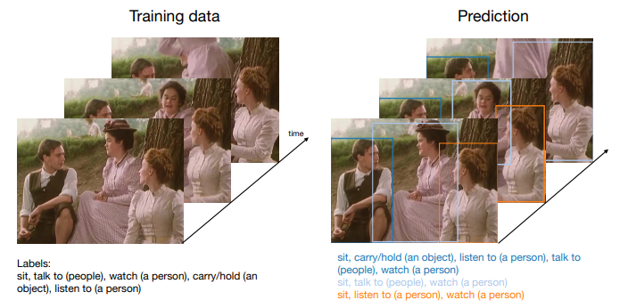

### [3].Beyond Controlled Environments: 3D Camera Re-Localization in Changing Indoor Scenes

作者 | Johanna Wald, Torsten Sattler, Stuart Golodetz, Tommaso Cavallari, Federico Tombari

单位 | 慕尼黑工业大学；查尔姆斯理工大学；捷克理工大学；Five AI Ltd；谷歌

论文 | https://arxiv.org/abs/2008.02004

主页 | https://waldjohannau.github.io/RIO10/

备注 | ECCV 2020

该文提出一种超越受控环境的室内场景变化中的3D摄像机重定位方法。

[视频](https://v.qq.com/x/page/p31431ge11o.html)

### [4].[Consistency Guided Scene Flow Estimation](https://arxiv.org/abs/2006.11242)

作者 | Yuhua Chen, Luc Van Gool, Cordelia Schmid, Cristian Sminchisescu

单位 | 谷歌，ETH Zurich

备注 | ECCV 2020

该文提出一种自监督学习框架，从立体视频中重建三维场景结构和运动。

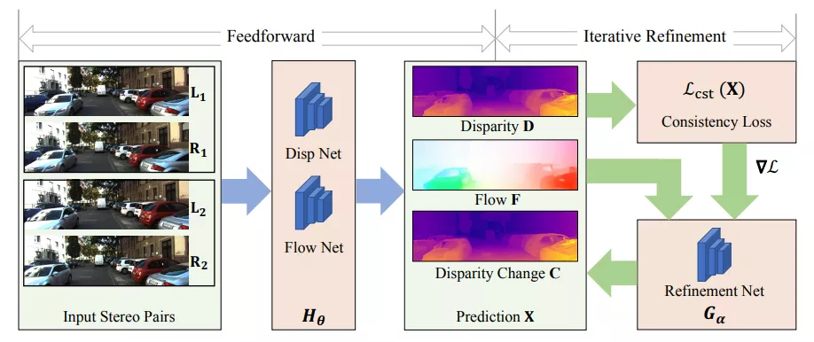

### [5].[Continuous Adaptation for Interactive Object Segmentation by Learning from Corrections](https://arxiv.org/abs/1911.12709)

作者 | Theodora Kontogianni, Michael Gygli, Jasper Uijlings, Vittorio Ferrari

单位 | 谷歌，亚琛工业大学
 
备注 | ECCV 2020

一种从用户校正操作中学习得到的交互式土体分割方法。

[视频](https://v.qq.com/x/page/i314393cnx6.html)

### 人体姿态估计

### [6].[SimPose: Effectively Learning DensePose and Surface Normals of People from Simulated Data](https://arxiv.org/abs/2007.15506)

作者 | Tyler Zhu, Per Karlsson, Christoph Bregler

单位 | 谷歌

备注 | ECCV 2020

对人体进行密集2.5D DensePose 和3D表面法向标注是非常昂贵的，该文提出一种从模拟数据经域适应技术进行真人密集姿态估计和表面法向量计算的方法，大幅降低了成本取得了不错的效果。

### [7].[Learning Data Augmentation Strategies for Object Detection](https://arxiv.org/abs/1906.11172)

作者 | Barret Zoph, Ekin D. Cubuk, Golnaz Ghiasi, Tsung-Yi Lin, Jonathon Shlens, Quoc V. Le

单位 | 谷歌

代码 | https://github.com/tensorflow/tpu/tree/master/

models/official/detection

备注 | ECCV 2020

数据增广是如此重要，已经获得大量研究者的关注，但作者发现对于图像分类有效的增广策略对目标检测的提升是有限的，于是作者提出一重可学习的用于目标检测特定任务的增广方法，实验中取得了2.3mAP的提升，而且将这种策略直接用于其他数据集，同样获得了2.7mAP的提升，证明这种方法推广性很好。

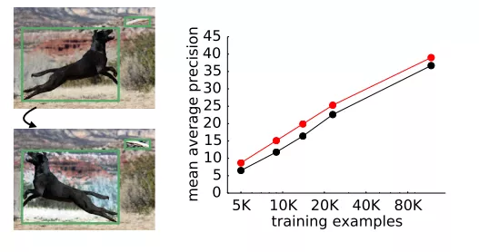

### [8].[Streaming Object Detection for 3-D Point Clouds](https://arxiv.org/abs/2005.01864)

作者 | Wei Han, Zhengdong Zhang, Benjamin Caine, Brandon Yang, Christoph Sprunk, Ouais Alsharif, Jiquan Ngiam, Vijay Vasudevan, Jonathon Shlens, Zhifeng Chen

单位 | 谷歌，Waymo

备注 | ECCV 2020

不同于RGB成像的相机，需要获得全部数据再进行后一步处理，这在自动驾驶汽车中会造成一定的延迟，该文针对激光雷达信号采集的流式的特点，设计一种流式目标检测的算法，降低了系统延迟。

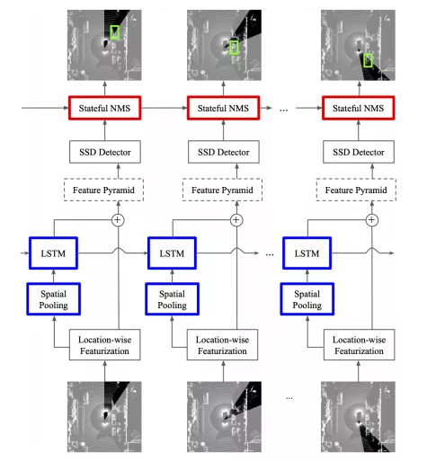

### [9].[Improving 3D Object Detection through Progressive Population Based Augmentation]( https://arxiv.org/abs/2004.00831)

作者 | Shuyang Cheng, Zhaoqi Leng, Ekin Dogus Cubuk, Barret Zoph, Chunyan Bai, Jiquan Ngiam, Yang Song, Benjamin Caine, Vijay Vasudevan, Congcong Li, Quoc V. Le, Jonathon Shlens, Dragomir Anguelov

单位 | Waymo LLC；谷歌

备注 | ECCV 2020

针对点云数据的目标检测的数据增广方法。

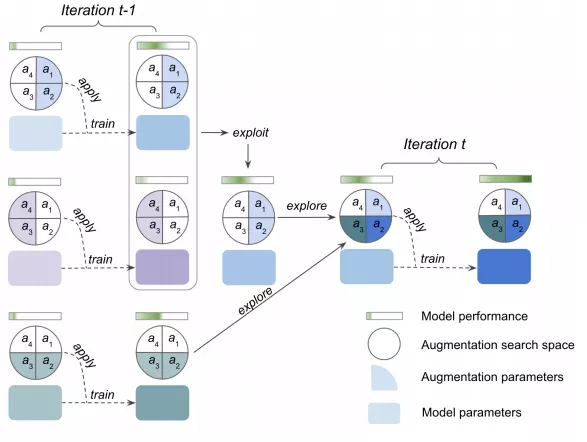

### 3D目标检测，LSTM，点云

### [10].[An LSTM Approach to Temporal 3D Object Detection in LiDAR Point Clouds](https://arxiv.org/abs/2007.12392)

作者 | Rui Huang, Wanyue Zhang, Abhijit Kundu, Caroline Pantofaru, David A Ross, Thomas Funkhouser, Alireza Fathi

单位 | 谷歌

主页 | https://sites.google.com/view/lstm-3d-detection/home

备注 | ECCV 2020

再点云数据中，基于LSTM的时序3D目标检测方法。

[视频](https://v.qq.com/x/page/g3143hnovrk.html)

### AutoML，NAS

### [11].[BigNAS: Scaling Up Neural Architecture Search with Big Single-Stage Models](https://arxiv.org/abs/2003.11142)

作者 | Jiahui Yu, Pengchong Jin, Hanxiao Liu, Gabriel Bender, Pieter-Jan Kindermans, Mingxing Tan, Thomas Huang, Xiaodan Song, Ruoming Pang, Quoc Le

单位 | 谷歌，University of Illinois at Urbana-Champaign

备注 | ECCV 2020

在NAS中一次搜索训练，得到多个不需要重训练或后处理的子模型，并且这些子模型精度超越了EfficientNets 和 Once-for-All 网络等工作。

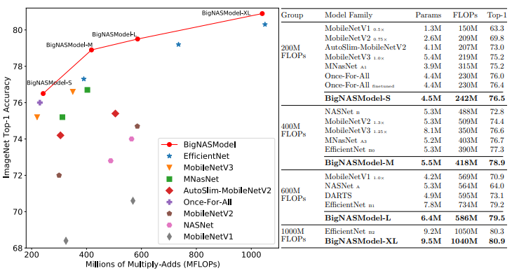

### [12].[Memory-Efficient Incremental Learning Through Feature Adaptation](https://arxiv.org/abs/2004.00713)

作者 | Ahmet Iscen, Jeffrey Zhang, Svetlana Lazebnik, Cordelia Schmid

单位 | 谷歌

备注 | ECCV 2020

基于特征适应的内存高效的增量学习法方法。

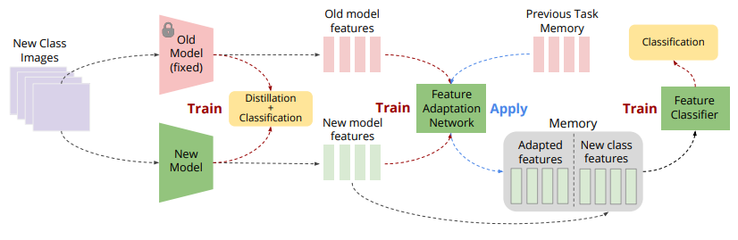

### [13].[Virtual Multi-view Fusion for 3D Semantic Segmentation](https://arxiv.org/abs/2007.13138)

作者 | Abhijit Kundu, Xiaoqi Yin, Alireza Fathi, David Ross, Brian Brewington, Thomas Funkhouser, Caroline Pantofaru

单位 | 谷歌

主页 | https://abhijitkundu.info/projects/multiview_segmentation/

备注 | ECCV 2020

虚拟多视图融合用于3D语义分割。

[视频](https://v.qq.com/x/page/l3143yjrw0s.html)

### 目标检测

### [14].[Efficient Scale-Permuted Backbone with Learned Resource Distribution](https://www.ecva.net/papers/eccv_2020/papers_ECCV/papers/123680562.pdf)

作者 | Xianzhi Du, Tsung-Yi Lin, Pengchong Jin, Yin Cui Mingxing Tan, Quoc Le, and Xiaodan Song

单位 | 谷歌

备注 | ECCV 2020

使用NAS搜索得到目标检测的骨干网络，在检测任务中超越EfficientDet,在分类、语义分割中也取得了不错效果。

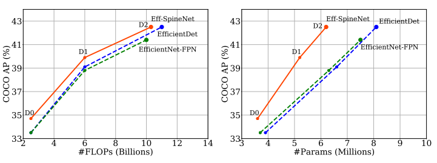

### [15].[RetrieveGAN: Image Synthesis via Differentiable Patch Retrieval](https://arxiv.org/abs/2007.08513)

作者 | Hung-Yu Tseng, Hsin-Ying Lee, Lu Jiang, Ming-Hsuan Yang, Weilong Yang

单位 | 谷歌，University of California, Merced，Yonsei University

备注 | ECCV 2020

通过可微分的Patch检索进行图像合成。

[video](https://v.qq.com/x/page/m3143bwgr7c.html)

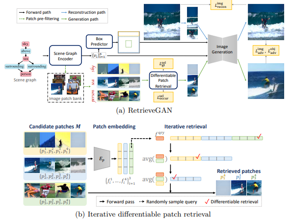

### [16].[Graph convolutional networks for learning with few clean and many noisy labels](https://arxiv.org/abs/1910.00324)

作者 | Ahmet Iscen, Giorgos Tolias, Yannis Avrithis, Ondrej Chum, Cordelia Schmid

单位 | 谷歌，Czech Technical University in Prague，Univ Rennes

备注 | ECCV 2020

通过图卷积网络在少量干净和大量含噪声样本中进行学习。

[video](https://v.qq.com/x/page/c3143lelklm.html)

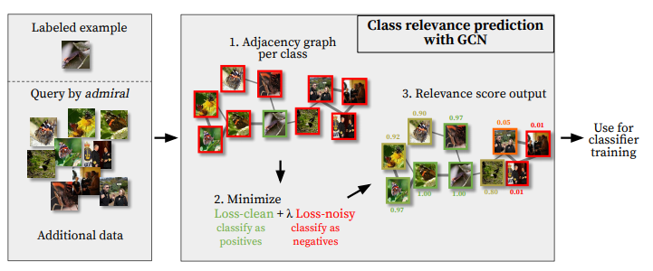

### [17].[Deep Positional and Relational Feature Learning for Rotation-Invariant Point Cloud Analysis](http://www.ecva.net/papers/eccv_2020/papers_ECCV/papers/123550222.pdf)

作者 | Ruixuan Yu , Xin Wei, Federico Tombari , and Jian Sun

单位 | 西安交通大学；慕尼黑工业大学；谷歌

备注 | ECCV 2020

旋转不变的点云分析。

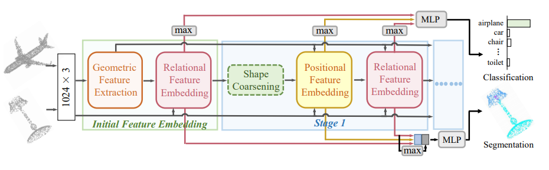

### [18].[Federated Visual Classification with Real-World Data Distribution](https://arxiv.org/abs/2003.08082)

作者 | Tzu-Ming Harry Hsu, Hang Qi, Matthew Brown

单位 | 麻省理工学院；谷歌

数据集 | https://github.com/google-research/google-research/tree/master/federated_vision_datasets

备注 | ECCV 2020

保护数据隐私的联邦学习。

[video](https://v.qq.com/x/page/q3143bwvf27.html)

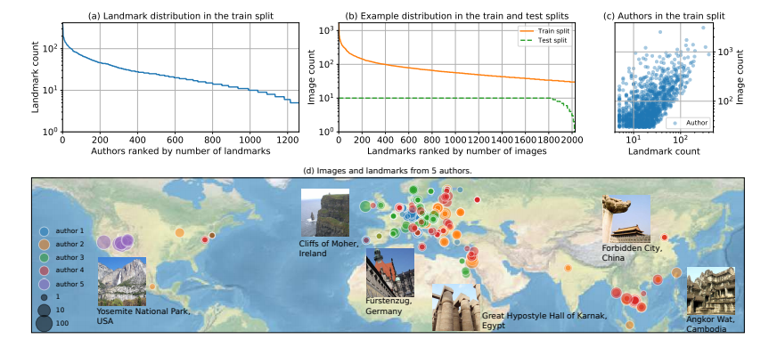

### [19].[Joint Bilateral Learning for Real-time Universal Photorealistic Style Transfer](https://arxiv.org/abs/2004.10955)

作者 | Xide Xia, Meng Zhang, Tianfan Xue, Zheng Sun, Hui Fang, Brian Kulis, Jiawen Chen

单位 | 波士顿大学；PixelShift.AI；谷歌

备注 | ECCV 2020

联合双边学习，用于实时通用逼真的风格迁移。

[video](https://v.qq.com/x/page/c3143u1tvk4.html)

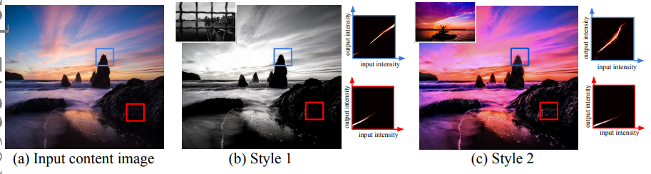

### 注意力机制，视频理解，活动识别

### [20].[AssembleNet++: Assembling Modality Representations via Attention Connections](https://arxiv.org/abs/2008.08072)

作者 | Michael S. Ryoo, AJ Piergiovanni, Juhana Kangaspunta, Anelia Angelova

单位 | 谷歌，Stony Brook University

代码 | https://github.com/google-research/google-research/tree/master/assemblenet

主页 | https://sites.google.com/view/assemblenet/

备注 | ECCV 2020

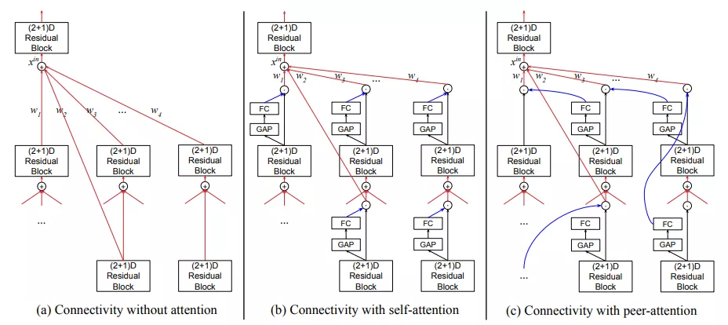

### 半监督学习+图像分割

### [21].[Naive-Student: Leveraging Semi-Supervised Learning in Video Sequences for Urban Scene Segmentation](https://arxiv.org/abs/2005.10266)

作者 | Liang-Chieh Chen, Raphael Gontijo Lopes, Bowen Cheng, Maxwell D. Collins, Ekin D. Cubuk, Barret Zoph, Hartwig Adam, Jonathon Shlens

单位 | 谷歌，UIUC

备注 | ECCV 2020

视频序列的半监督学习用于城市场景分割。

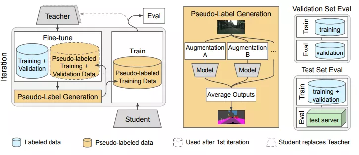

### 视频分类

### [22].[AttentionNAS: Spatiotemporal Attention Cell Search for Video Classification](https://arxiv.org/abs/2007.12034)

作者 | Xiaofang Wang, Xuehan Xiong, Maxim Neumann, AJ Piergiovanni, Michael S. Ryoo, Anelia Angelova, Kris M. Kitani, Wei Hua

单位 | 谷歌；卡内基梅隆大学

备注 | ECCV 2020

将时空注意力与NAS结合的视频分类模型。

[video](https://v.qq.com/x/page/m3143ko8nyq.html)

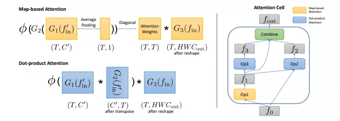

### 图像检索

### [23].[Unifying Deep Local and Global Features for Image Search](https://arxiv.org/abs/2001.05027)

作者 | Bingyi Cao, Andre Araujo, Jack Sim

单位 | 谷歌

代码 | https://github.com/tensorflow/models/tree/master/research/delf

备注 | ECCV 2020

统一深度局部和全局特征的图像搜索。

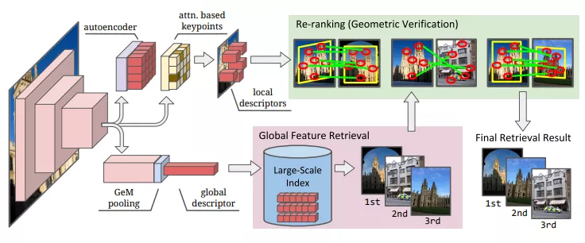

### [24].[Pillar-based Object Detection for Autonomous Driving](https://arxiv.org/abs/2007.10323)

作者 | Yue Wang, Alireza Fathi, Abhijit Kundu, David Ross, Caroline Pantofaru, Thomas Funkhouser, Justin Solomon

单位 | 麻省理工学院；谷歌

代码 | https://github.com/WangYueFt/pillar-od

备注 | ECCV 2020

自动驾驶目标检测。

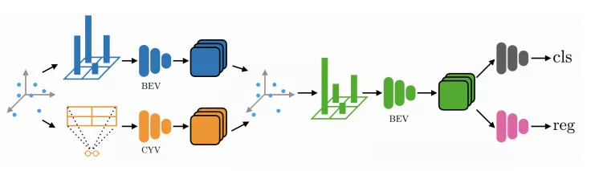

### [25].[Improving Object Detection with Selective Self-supervised Self-training](https://arxiv.org/abs/2007.09162)

作者 | Yandong Li, Di Huang, Danfeng Qin, Liqiang Wang, Boqing Gong

单位 | 中佛罗里达大学；谷歌

备注 | ECCV 2020

通过可选择的自监督自训练方法改进目标检测。

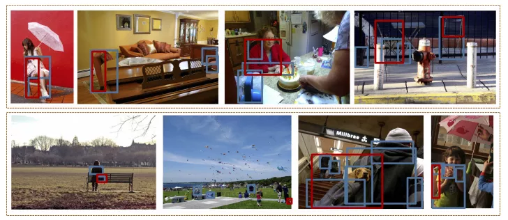

### [26].[Environment-agnostic Multitask Learning for Natural Language Grounded Navigation](https://arxiv.org/abs/2003.00443)

作者 | Xin Eric Wang, Vihan Jain, Eugene Ie, William Yang Wang, Zornitsa Kozareva, Sujith Ravi

单位 | 加利福尼亚大学圣克鲁兹分校；加州大学圣巴巴拉分校；谷歌；亚马逊

代码 | https://github.com/google-research/valan

备注 | ECCV 2020

面向自然语言的导航的环境不可知多任务学习。

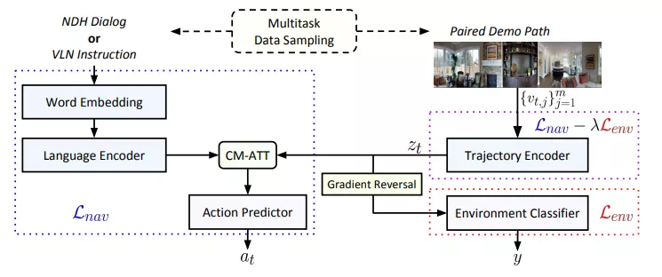

### [27].[SimAug: Learning Robust Representations from Simulation for Trajectory Prediction](https://arxiv.org/abs/2004.02022)

作者 | Junwei Liang, Lu Jiang, Alexander Hauptmann

单位 | 卡内基梅隆大学；谷歌

代码 | https://github.com/JunweiLiang/Multiverse/tree/master/SimAug

主页 | https://next.cs.cmu.edu/simaug/

备注 | ECCV 2020

从仿真数据中学习用于轨迹预测的鲁棒表示。

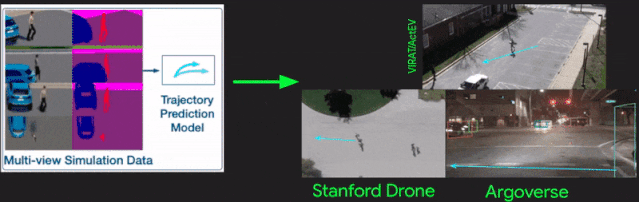

