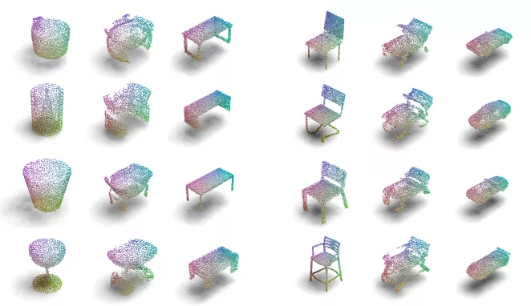
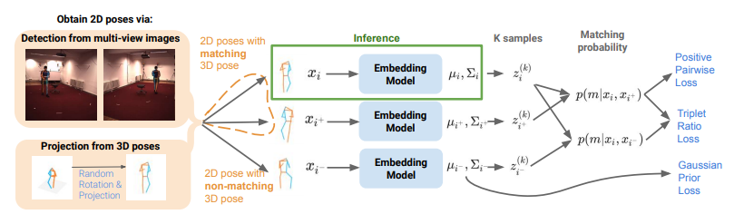
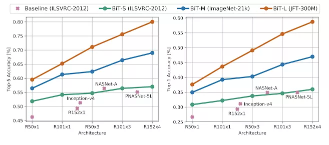
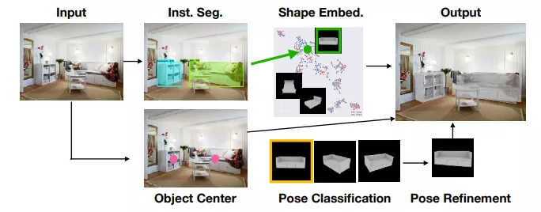
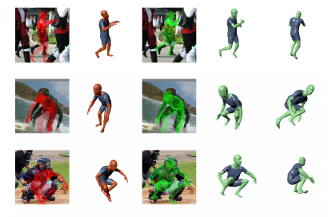
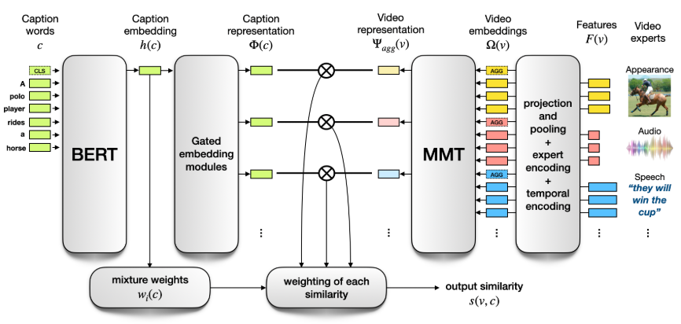

  

ECCV2020 已经结束，官方放出了所有论文：
[ECCV 2020 论文合集下载，分类盘点进行中](http://mp.weixin.qq.com/s?__biz=MzUzODkxNzQzMw==&mid=2247485298&idx=1&sn=b63aab38c48baf6491996e286987d5d8&chksm=fad12824cda6a13203b393c15e96e1ad6ec0241a820c7ea537ed5cf52a74531b17df634f3dc8&scene=21#wechat_redirect)

ECCV 2020 总计录取1361篇论文，其中Oral 102篇，Spotlight 161 篇。

前文已经汇总了ECCV 2020 Oral论文中谷歌公司参与的相关论文：

[ECCV 2020 Oral 中谷歌论文盘点，点云与3D方向工作居多](https://github.com/52CV/ECCV-2020-Papers)

共计10篇。

本文继续盘点谷歌 Spotlight 中论文，看看工业界巨头都在关注什么方向，取得了哪些突破。该部分论文总计 12 篇，

## 点云分类、数据增强
### [1].[PointMixup: Augmentation for Point Clouds](https://arxiv.org/abs/2008.06374)

作者 | Yunlu Chen, Vincent Tao Hu, Efstratios Gavves, Thomas Mensink, Pascal Mettes, Pengwan Yang, Cees G.M. Snoek

单位 | 阿姆斯特丹大学；谷歌；北大

代码 | https://github.com/yunlu-chen/PointMixup/

备注 | ECCV 2020  Spotlight

Mixup 在2D图像的深度学习训练数据增广中获得了巨大的成功，该文是把其扩展到了点云领域，想想其实是很自然要做的事儿。

### [2].[Connecting Vision and Language with Localized Narratives](https://arxiv.org/abs/1912.03098)

作者 | Jordi Pont-Tuset, Jasper Uijlings, Soravit Changpinyo, Radu Soricut, Vittorio Ferrari

单位 | 谷歌

解读 | [900万注释图像数据集升级了！谷歌开放Open Images V6，首增语音、文本、鼠标轨迹同步注释](http://mp.weixin.qq.com/s?__biz=MzIwMTE1NjQxMQ==&mid=2247491550&idx=2&sn=bcfb59a8db491cda9d96605a6a5cd539&chksm=96f36d8aa184e49ccb75a19f67461d1724885cd82a9379dde02e82913c71f4cb9ebbfda6ab87&scene=21#wechat_redirect)

备注 | ECCV 2020 Spotlight

超大数据集 Open Images 的更新，新增了507444个局部叙事。连接视觉与语言，这是一个可能会出现颠覆性创新的领域。

[视频](https://v.qq.com/x/page/i31439l40sw.html)

### [3].[View-Invariant Probabilistic Embedding for Human Pose](https://arxiv.org/abs/1912.01001)

作者 | Jennifer J. Sun, Jiaping Zhao, Liang-Chieh Chen, Florian Schroff, Hartwig Adam, Ting Liu

单位 | 加州理工学院；谷歌

代码 | https://github.com/google-research/google-research/tree/master/poem

视频结果 | https://drive.google.com/drive/folders/1kTc_UT0Eq0H2ZBgfEoh8qEJMFBouC-Wv

备注 | ECCV 2020 Spotlight

该文发明了一种视角不变的概率嵌入模型，用于人体姿态的表示，在人体姿态检索、动作识别、视频对齐中获得了成功应用。

### [4].[Big Transfer (BiT): General Visual Representation Learning](https://arxiv.org/abs/1912.11370)

作者 | Alexander Kolesnikov, Lucas Beyer, Xiaohua Zhai, Joan Puigcerver, Jessica Yung, Sylvain Gelly, Neil Houlsby

单位 | 谷歌；Z¨urich, Switzerland

代码 | https://github.com/google-research/big_transfer

解读 | [谷歌发布最先进的计算机视觉迁移模型BigTransfer（BiT）](http://mp.weixin.qq.com/s?__biz=MzIwMTE1NjQxMQ==&mid=2247511891&idx=2&sn=b47b59b35ad1da11f18456390fca35c4&chksm=96f0dd07a18754110ebe8c3e4e86344e2943478913ef20009ab4d23cd1f7cbbf012b833ce6ae&scene=21#wechat_redirect)

备注 | ECCV 2020 Spotlight

使用大型数据集训练并开放了模型，有助于CV社区模型预训练的研究。

 ## 全景分割

### [5].[Axial-DeepLab: Stand-Alone Axial-Attention for Panoptic Segmentation](https://arxiv.org/abs/2003.07853)

作者 | Huiyu Wang, Yukun Zhu, Bradley Green, Hartwig Adam, Alan Yuille, Liang-Chieh Chen

单位 | 约翰斯·霍普金斯大学；谷歌

代码 | https://github.com/csrhddlam/axial-deeplab

备注 | ECCV 2020 Spotlight

DeepLab系分割算法向全景分割的演化。

[视频](https://v.qq.com/x/page/y3143qy81dh.html)

### [6].[Mask2CAD: 3D Shape Prediction by Learning to Segment and Retrieve](https://arxiv.org/abs/2007.13034)

作者 | Weicheng Kuo, Anelia Angelova, Tsung-Yi Lin, Angela Dai

单位 | 谷歌；慕尼黑工业大学

备注 | ECCV 2020 Spotlight

学习分割和检索的三维形状预测。

### [7].[A Generalization of Otsu's Method and Minimum Error Thresholding](https://arxiv.org/abs/2007.07350)

作者 | Jonathan T. Barron

单位 | 谷歌

代码 | https://github.com/jonbarron/hist_thresh

备注 | ECCV 2020 Spotlight

大津法阈值化的推广，一个简单快速的 Bayesian 算法，用大约10行代码编写，在图像二值化上优于或匹配大型CNN网络，统一了三种经典的阈值化算法。

[视频](https://v.qq.com/x/page/u3143o8drc3.html)

### [8].[Learning to Factorize and Relight a City](https://arxiv.org/abs/2008.02796)

作者 | Andrew Liu, Shiry Ginosar, Tinghui Zhou, Alexei A. Efros, Noah Snavely

单位 | 谷歌；UC伯克利；Humen AI

主页 | https://factorize-a-city.github.io/

备注 | ECCV 2020 Spotlight

城市级场景的分解及重打光特效。

[视频](https://v.qq.com/x/page/g31434o33s9.html）

### [9].[Weakly Supervised 3D Human Pose and Shape Reconstruction with Normalizing Flows](https://arxiv.org/abs/2003.10350)

作者 | Andrei Zanfir, Eduard Gabriel Bazavan, Hongyi Xu, Bill Freeman, Rahul Sukthankar, Cristian Sminchisescu

单位 | 谷歌

备注 | ECCV 2020 Spotlight

弱监督3D人体姿态估计与形状重建，对高标准的标注数据需求降低，更加实用。

## 视频检索

### [10].[Multi-modal Transformer for Video Retrieval](https://arxiv.org/abs/2007.10639)

作者 | Valentin Gabeur, Chen Sun, Karteek Alahari, Cordelia Schmid

单位 | Inria；谷歌

主页 | http://thoth.inrialpes.fr/research/MMT/

备注 | ECCV 2020 Spotlight

多模态的Transformer 用于大规模视频检索。

## 三维重建

### [11].[GeLaTO: Generative Latent Textured Objects](https://arxiv.org/abs/2008.04852)

作者 | Ricardo Martin-Brualla, Rohit Pandey, Sofien Bouaziz, Matthew Brown, Dan B Goldman

单位 | 谷歌

主页 | https://gelato-paper.github.io/

备注 | ECCV 2020 Spotlight

该文发明了一种生成式潜在纹理对象的方法，用于物体的三维重建，对透明的、反光的、细的物体的重建效果更好。

[视频](https://v.qq.com/x/page/v3143j68keb.html)
