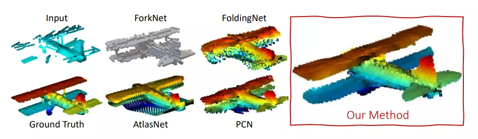
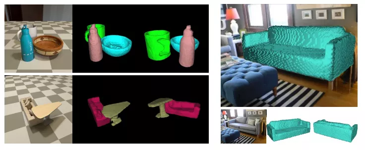
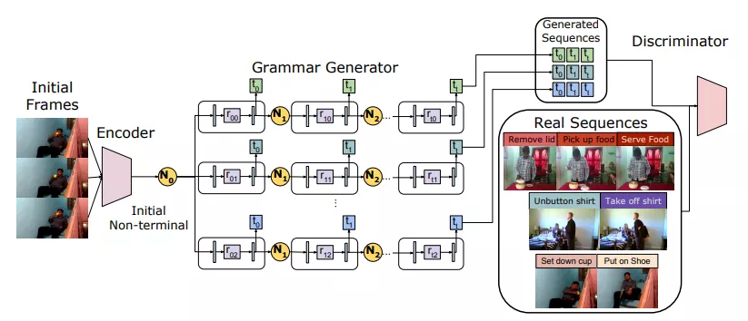
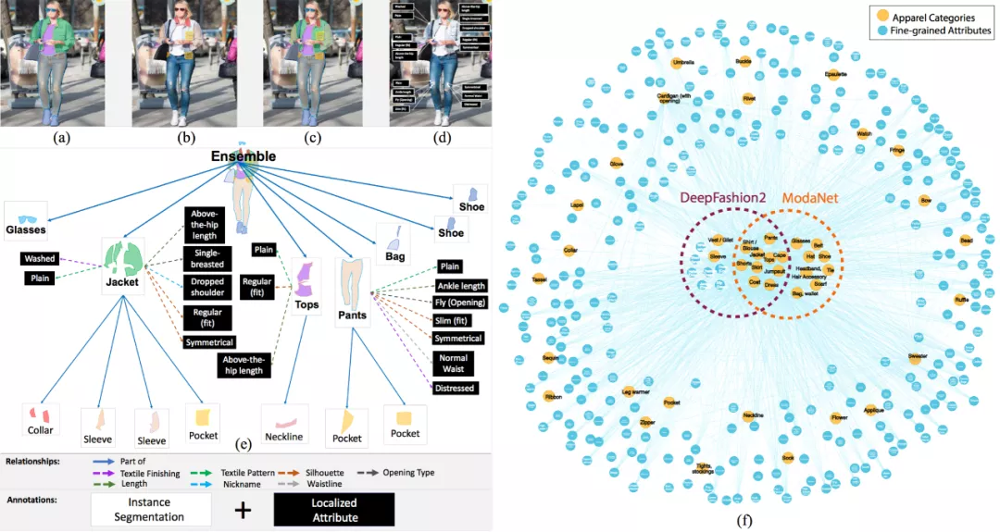

# ECCV2020-Papers

  

ECCV2020 已经结束，官方放出了所有论文：
ECCV 2020 论文合集下载，分类盘点进行中

谷歌作为人工智能研究领域工业界的领头羊，其工作是非常值得参考的。

本文汇总其入选 ECCV 2020 Oral 的作品，总计 10 篇。这些论文分布在神经渲染、点云、3D人体重建、3D场景重建、人类行为预测、光流、自监督、6D位姿估计等领域，特别值得一提的是「NeRF: Representing Scenes as Neural Radiance Fields for View Synthesis 」获得最佳论文荣誉提名！其展示效果让人惊艳。

## 最佳论文荣誉提名

### [1].NeRF: Representing Scenes as Neural Radiance Fields for View Synthesis

作者 | Ben Mildenhall、Pratul P. Srinivasan、Matthew Tancik、Jonathan T. Barron、Ravi Ramamoorthi、Ren Ng

单位 | UC 伯克利；谷歌；加州大学圣地亚哥分校

论文 | https://arxiv.org/abs/2003.08934

主页 | https://www.matthewtancik.com/nerf

备注 | ECCV 2020 Oral

解读 | https://zhuanlan.zhihu.com/p/187541908

发明了一种称之为神经辐射场的方法用于场景3D新视野的合成，输入不同视角下拍的图片，合成未出现的视角的图像。

[视频]（https://v.qq.com/x/page/h3142xsoy0d.html）

### [2].Quaternion Equivariant Capsule Networks for 3D Point Clouds

作者 | Yongheng Zhao, Tolga Birdal, Jan Eric Lenssen, Emanuele Menegatti, Leonidas Guibas, Federico Tombari

单位 | 帕多瓦大学；斯坦福大学；慕尼黑工业大学；多特蒙德工业大学；谷歌

论文 | https://arxiv.org/abs/1912.12098

代码 | https://github.com/tolgabirdal/qecnetworks

主页 | https://tolgabirdal.github.io/qecnetworks/

备注 | ECCV 2020 Oral 

发明了新的3D胶囊网络，用于3D识别与方向估计。

[视频]（https://v.qq.com/x/page/x3142gektqm.html）

### [3].SoftPoolNet: Shape Descriptor for Point Cloud Completion and Classification

作者 | Yida Wang, David Joseph Tan, Nassir Navab, Federico Tombari

单位 | Technische Universit¨at M¨unchen；谷歌

论文 | https://arxiv.org/abs/2008.07358

备注 | ECCV 2020 Oral 

发明了新的用于点云的形状描述，用于点云补全和分类。

### [4].Combining Implicit Function Learning and Parametric Models for 3D Human Reconstruction

作者 | Bharat Lal Bhatnagar, Cristian Sminchisescu, Christian Theobalt, Gerard Pons-Moll

单位 | 萨尔大学；谷歌

论文 | https://arxiv.org/abs/2007.11432

代码 | https://github.com/bharat-b7/IPNet

主页 | http://virtualhumans.mpi-inf.mpg.de/ipnet/

备注 | ECCV 2020 Oral 

结合隐式函数与参数模型的3D人体重建。

### [5].CoReNet: Coherent 3D scene reconstruction from a single RGB image

作者 | Stefan Popov, Pablo Bauszat, Vittorio Ferrari

单位 | 谷歌

论文 | https://arxiv.org/abs/2004.12989

备注 | ECCV 2020 Oral 

从单幅图片进行连贯的3D场景重建。

### [6].Adversarial Generative Grammars for Human Activity Prediction

作者 | AJ Piergiovanni, Anelia Angelova, Alexander Toshev, Michael S. Ryoo

单位 | 谷歌；石溪大学

论文 | https://arxiv.org/abs/2008.04888

代码 | 即将

备注 | ECCV 2020 Oral 

对抗生成语法用于人类活动预测。

### [7].Self6D: Self-Supervised Monocular 6D Object Pose Estimation

作者 | Gu Wang, Fabian Manhardt, Jianzhun Shao, Xiangyang Ji, Nassir Navab, Federico Tombari

单位 | 清华大学；慕尼黑工业大学；谷歌

论文 | https://arxiv.org/abs/2004.06468

代码 | https://github.com/THU-DA-6D-Pose-Group/Self6D-Diff-Renderer

备注 | ECCV 2020 Oral 

自监督学习+单目6D位姿估计。

[视频]（https://v.qq.com/x/page/x3142wjh1a4.html）

### [8].What Matters in Unsupervised Optical Flow？

作者 | Rico Jonschkowski, Austin Stone, Jonathan T. Barron, Ariel Gordon, Kurt Konolige, Anelia Angelova

单位 | 谷歌

论文 | https://arxiv.org/abs/2006.04902

代码 | https://github.com/google-research/google-research/tree/master/uflow

备注 | ECCV 2020 Oral 

非监督光流估计研究。

[视频]（https://v.qq.com/x/page/n3142izqqd8.html）

### [9].Appearance Consensus Driven Self-Supervised Human Mesh Recovery

作者 | Jogendra Nath Kundu, Mugalodi Rakesh, Varun Jampani, Rahul Mysore Venkatesh, R. Venkatesh Babu

单位 | Indian Institute of Science, Bangalore；谷歌

论文 | https://arxiv.org/abs/2008.01341

代码 | 即将

主页 | https://sites.google.com/view/ss-human-mesh

备注 | ECCV 2020 Oral 

表观共识驱动的自监督人体网格修复。

[视频]（https://v.qq.com/x/page/l3142ak2fht.html）

### [10].Fashionpedia: Ontology, Segmentation, and an Attribute Localization Dataset

作者 | Menglin Jia, Mengyun Shi, Mikhail Sirotenko, Yin Cui, Claire Cardie, Bharath Hariharan, Hartwig Adam, Serge Belongie

单位 | 康奈尔大学；康奈尔科技校区；谷歌等

论文 | https://arxiv.org/abs/2004.12276

主页 | https://fashionpedia.github.io/home/index.html

备注 | ECCV 2020 Oral 

定义了一个实例分割与细粒度属性定位的视觉新任务，并提出一个时尚领域的数据集。

