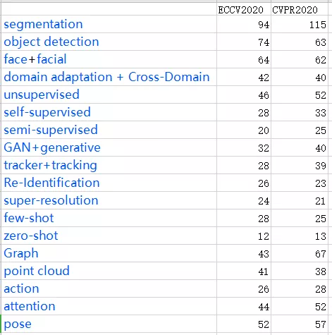

# ECCV2020-Papers

  

今年第二个计算机视觉顶会 ECCV 2020 已经结束，官方已经放出了所有的论文列表（1357篇），并开放下载。

https://www.ecva.net/papers.php

大家可以在上述网页查看感兴趣的论文，所有论文均可直接下载。

另外，CV君也已经将所有论文打包，在OpenCV中文网公众号后台回复“ECCV2020”，即可收到百度云下载链接。

CV君在论文标题中检索了一些热门技术相关的关键词，并与CVPR 2020 （1467篇）比较：

可见两大顶会上的热点关键词的论文数目相差并不太多，且分布趋势相似。

分割、检测、人脸等传统热门方向的论文仍然是最多的。

和数据像相关的跨域、无监督、半监督、自监督吸引了不少学者关注。

当然从论文标题中并不能完全反应论文的内容，但大致的趋势是可以了解的。

还有很多值得探索，后续CV君会对 ECCV2020 论文进行分方向技术盘点。

### [ECCV 2020 oral 谷歌论文大盘点](https://github.com/52CV/ECCV-2020-Papers/blob/master/Google-oral-papers.md)

### [ECCV 2020 Spotlight 谷歌论文大盘点](https://github.com/52CV/ECCV-2020-Papers/blob/master/Google-spotlight-papers.md)

### [ECCV 2020 Poster 谷歌论文大盘点](https://github.com/52CV/ECCV-2020-Papers/blob/master/Google-poster-papers.md)

### [ECCV 2020 论文大盘点-人脸技术篇](https://github.com/52CV/ECCV-2020-Papers/blob/master/ECCV2020-Face-Papers.md)

### [ECCV 2020 论文大盘点-目标跟踪篇](https://github.com/52CV/ECCV-2020-Papers/blob/master/ECCV2020-Tracker-Papers.md)

### [ECCV 2020 论文大盘点-目标检测篇](https://mp.weixin.qq.com/s/dvue9Kx6UQ5iGE-Z615Tug)

### [ECCV 2020论文大盘点-3D目标检测篇](https://mp.weixin.qq.com/s/BTKKi_1mk6AbmO6xTVANCw)

Enjoy！
